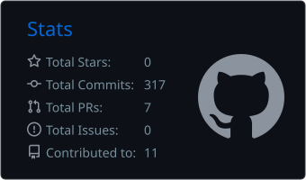
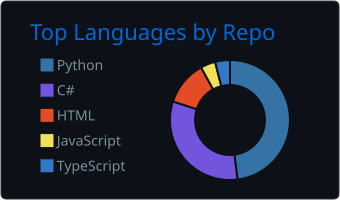

<!-- ===================== HEADER ===================== -->
<div align="center">


<a href="https://github.com/Scaglia05">
  
</a>

<br/>

<a href="https://www.linkedin.com/in/guilherme-scaglia-654a63236/">
  
</a>
<a href="mailto:guiscaglia2011@hotmail.com">
  
</a>


</div>

<!-- ===================== SOBRE ===================== -->
## 👋 Sobre mim

Sou estudante de **Engenharia da Computação** na FHO e passo boa parte do tempo no ecossistema **.NET**, com **Blazor** no front e **C#** no back. Gosto de construir coisas que funcionam bem no mundo real e de juntar **software com hardware**, do sistema web ao sensor em campo.

```csharp
public class GuilhermeScaglia : Developer
{
    public string Formacao   => "Engenharia da Computação @ FHO";
    public string[] Stack    => ["C#", ".NET", "Blazor", "SQL", "Python"];
    public string[] Curto    => ["Arquitetura de software", "Performance", "Sistemas embarcados", "IoT"];
    public string Estudando  => "Microsserviços e infraestrutura na Azure";
    public string Objetivo   => "Aprender novas tecnologias, aprimorar o que já sei e aplicar na prática.";
}
```

<!-- ===================== PROJETOS ===================== -->
<!-- Seção gerada automaticamente por .github/workflows/atualizar-projetos.yml -->
## 🚀 Projetos recentes

> Atualizado automaticamente com meus repositórios mais recentes. Clique para expandir 👇

<!-- PROJETOS:INICIO -->
<details open>
<summary><b>📁 Grafo-SistemaEntregas</b> · HTML</summary>
<br/>


Menor caminho em grafo de logística (centros de distribuição × clientes) com Dijkstra e Bellman-Ford e mapa Leaflet/OpenStreetMap — Blazor Web App .NET 10. Trabalho de Grafos, Tema 7 / Grupo 04 (FHO).

<code>academic-project</code> <code>bellman-ford</code> <code>blazor</code> <code>csharp</code> <code>dijkstra</code> <code>dotnet</code> <code>graph-algorithms</code> <code>haversine</code> <code>leaflet</code> <code>logistics</code> <code>net10</code> <code>openstreetmap</code> <code>shortest-path</code>

🔗 [Ver repositório](https://github.com/Scaglia05/Grafo-SistemaEntregas) · 🕒 Atualizado em 06/09/2026
</details>

<details>
<summary><b>📁 Yuta.FactoryOps</b> · C#</summary>
<br/>


A plataforma FactoryOps é um ecossistema industrial de alta tecnologia projetado pela YUTA LTDA para unificar o monitoramento operacional de processos e a manutenção preditiva/prescritiva de ativos críticos.

🔗 [Ver repositório](https://github.com/Scaglia05/Yuta.FactoryOps) · 🌐 [Demo](https://yuta-factoryops.onrender.com) · 🕒 Atualizado em 03/08/2026
</details>

<details>
<summary><b>📁 fho-data-auto-mpg</b> · Python</summary>
<br/>


Análise e modelo de regressão para prever consumo de combustível (mpg) com o dataset Auto-MPG — projeto FHO-DATA de Ciência de Dados.

<code>auto-mpg</code> <code>data-science</code> <code>fho</code> <code>machine-learning</code> <code>pandas</code> <code>python</code> <code>regression</code> <code>skit-learn</code>

🔗 [Ver repositório](https://github.com/Scaglia05/fho-data-auto-mpg) · 🌐 [Demo](https://www.kaggle.com/datasets/uciml/autompg-dataset) · 🕒 Atualizado em 25/07/2026
</details>

<details>
<summary><b>📁 LibrasLens</b> · Python</summary>
<br/>


Tradutor de LIBRAS em tempo real com IA (LSTM) e MediaPipe. Converte gestos capturados via webcam em texto e voz para promover a acessibilidade.

<code>acessibilidade</code> <code>ia</code> <code>libras</code> <code>lstm</code> <code>mediapipe</code> <code>python</code> <code>pytorch</code>

🔗 [Ver repositório](https://github.com/Scaglia05/LibrasLens) · 🌐 [Demo](https://www.linkedin.com/in/guilherme-scaglia-654a63236) · 🕒 Atualizado em 08/07/2026
</details>

<details>
<summary><b>📁 SistemaOperacional10.0</b> · C#</summary>
<br/>


O projeto é um simulador de Sistema Operacional em C#, que demonstra na prática o funcionamento das políticas de escalonamento de processos. Ele gerencia criação, execução e finalização de processos, além da alocação de memória e uso dos núcleos da CPU, permitindo visualizar como cada política afeta o desempenho e a organização do sistema.

🔗 [Ver repositório](https://github.com/Scaglia05/SistemaOperacional10.0) · 🕒 Atualizado em 15/12/2025
</details>

<!-- PROJETOS:FIM -->

<!-- ===================== STACK ===================== -->
## 🛠️ Arsenal tecnológico

<table align="center">
  <tr>
    <td align="center"><b>💻 Back-end</b></td>
    <td align="center"><b>🎨 Front-end</b></td>
    <td align="center"><b>🚀 Infra & Ferramentas</b></td>
  </tr>
  <tr>
    <td align="center"><br/><sub>C# · .NET · Python · SQL</sub></td>
    <td align="center"><br/><sub>Blazor · React / React Native · JS</sub></td>
    <td align="center"><br/><sub>Docker · Git · Azure · Visual Studio</sub></td>
  </tr>
</table>

<!-- ===================== STATS ===================== -->
<!-- Gerados pela Action .github/workflows/profile-summary-cards.yml -->
## 📊 GitHub Stats

<div align="center">
  
  
</div>

<div align="center">
  
</div>

<br/>

<div align="center">
  <picture>
    <source media="(prefers-color-scheme: dark)" srcset="https://raw.githubusercontent.com/Scaglia05/Scaglia05/output/github-contribution-grid-snake-dark.svg" />
    <source media="(prefers-color-scheme: light)" srcset="https://raw.githubusercontent.com/Scaglia05/Scaglia05/output/github-contribution-grid-snake.svg" />
    
  </picture>
</div>

<!-- ===================== FOOTER ===================== -->

